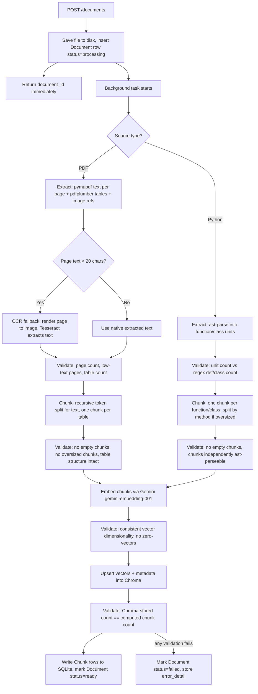
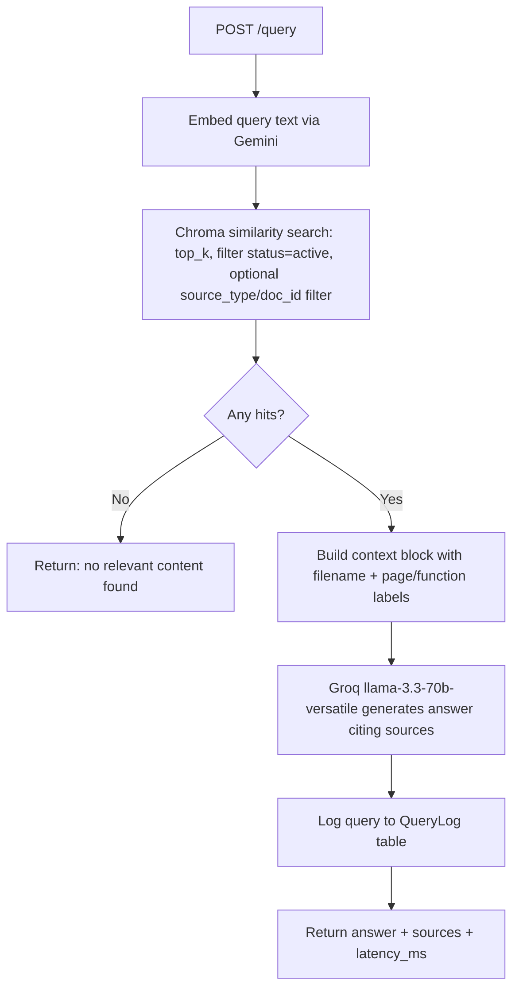
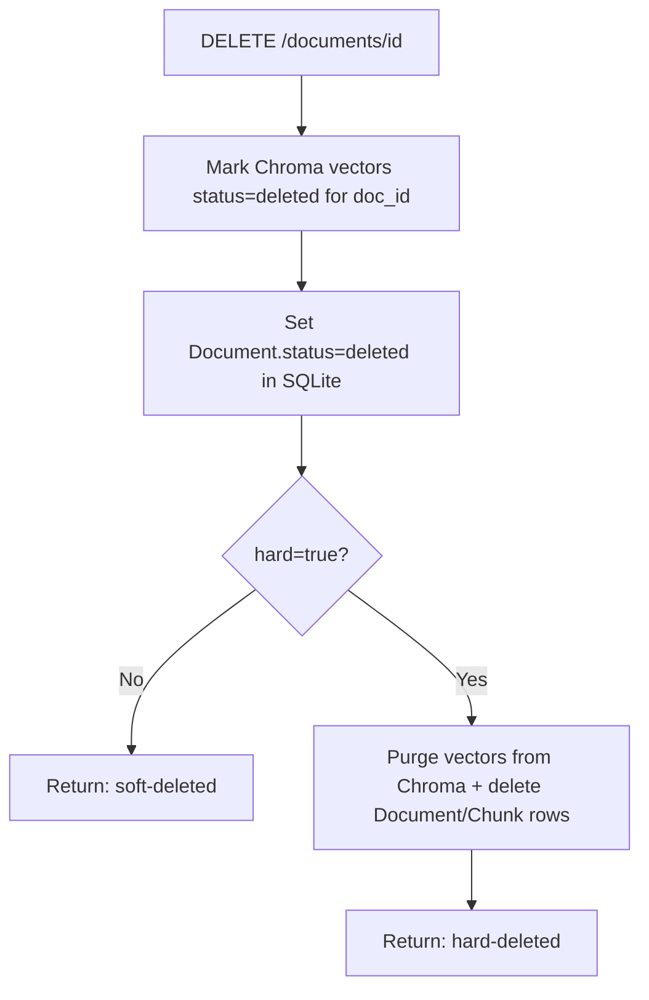

# Architecture

## Overview

The platform ingests documents (PDF or Python source) and answers natural-language
questions about them using retrieval-augmented generation. It exposes three core
REST endpoints (`POST /documents`, `POST /query`, `DELETE /documents/{id}`).

## Ingestion flow

Every arrow into a "Validate" box is a real assertion in code (see `app/ingestion.py`
`ValidationReport` objects), not just a comment. A failed validation short-circuits
the pipeline and marks the document `failed` with the reason recorded, rather than
silently proceeding on bad data.

**Why OCR was added:** the provided `Knowledge_Base_Sample.pdf` turned out to be
image-based rather than text-native — native PyMuPDF extraction returned near-empty
text on most pages. Rather than proceed with near-empty chunks (which would have
silently produced a broken knowledge base), extraction falls back to Tesseract OCR
on a per-page basis whenever native extraction yields under 20 characters. This is
a direct consequence of the extraction-validation discipline described above: the
low-text-page check caught the problem, and OCR was the fix rather than ignoring
the warning.

## Query flow

## Delete flow

## Component responsibilities

| Component | File | Responsibility |
|---|---|---|
| API layer | `app/routes.py` | Thin orchestration: receives requests, calls the other layers, returns responses |
| Ingestion | `app/ingestion.py` | Extraction, chunking, and validation logic for both PDF and code |
| External model calls | `app/ai_clients.py` | Gemini embeddings, Groq generation, shared retry/backoff |
| Vector store | `app/vectorstore.py` | Chroma collection management, similarity search, soft/hard delete |
| Relational data | `app/database.py` | SQLAlchemy async engine + Document/Chunk/QueryLog models |
| Config | `app/config.py` | All environment-driven settings in one place |

## Why background tasks instead of Celery/Redis

FastAPI's `BackgroundTasks` (implemented here via `asyncio.create_task`) is sufficient
for ~100 internal users uploading documents occasionally. It avoids the operational
overhead of a broker + worker pool for a system at this scale. See
`docs/SCALING_TRADEOFFS.md` for when this stops being true and Celery+Redis becomes
worth the complexity.

## System dependency: Tesseract OCR

The OCR fallback requires Tesseract installed as a system binary (not a pip package)
and available on PATH, or its path set explicitly via
`pytesseract.pytesseract.tesseract_cmd`. See https://github.com/UB-Mannheim/tesseract/wiki
for Windows installers. Without Tesseract installed, PDFs with image-only pages will
fail extraction validation (`low_text_pages` will be non-empty) rather than silently
producing empty chunks — the validation step surfaces this rather than hiding it.